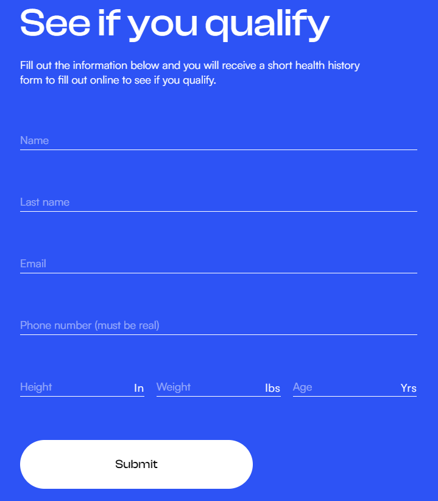
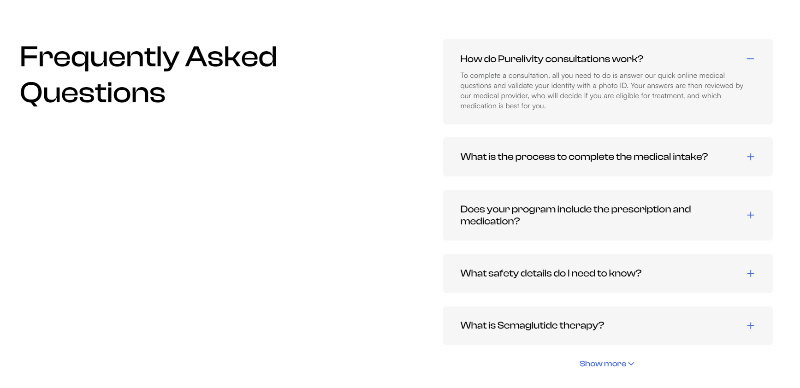

# Purelivity Wellness (real order)

[Here you can check it](https://semaglutide.purelivitywellness.com/)

---

I had figma design for this project.
This landing page is 100% responsive for all types of screens.
I used HTML, CSS, JS in this project.

---

### What was interesting in this project:

1. Custom form with interesting functionality. Form sends data to owners email and also sends data to Klaiyo email service. It's creating new subscription there. Used Klaviyo API for it.



```
  const options = {
    method: 'POST',
    headers: { revision: '2023-10-15', 'content-type': 'application/json' },
    body: JSON.stringify({ data }),
  };
  fetch('https://a.klaviyo.com/client/subscriptions/?company_id=X3HpFg', options)
    .then((response) => response)
    .then((response) => console.log(response))
    .catch((err) => console.error(err));

```

2. Ask section created with boostrap dropdowns.


